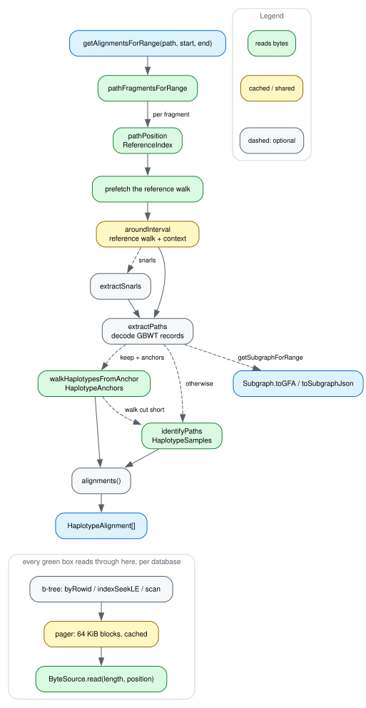

# How a query flows

[dataflow.dot](img/dataflow.dot) is the source; see
[CONTRIBUTING.md](../CONTRIBUTING.md) for how to re-render it.

The spine is `getAlignmentsForRange`. `getSubgraphForRange` is the same path up
to `extractPaths` and then hands the `Subgraph` back rather than aligning it —
the dashed branch on the right. The green boxes are the ones that read bytes,
and every one of them goes through the storage layer at the bottom.

## Down the spine

**`pathFragmentsForRange`** turns the path name into the fragments of it that
overlap the window, since a contig can be stored as several path fragments with
gaps between them. `getAlignmentsForRange` runs the rest once per fragment and
concatenates; `getSubgraphForRange` takes the first.

**`pathPosition`** finds the path row and seeks `ReferenceIndex` for the GBWT
position at the window's start, which is where the walk begins. A path that
exists but was never indexed for random access throws here.

**Prefetching the reference walk** is one range request per run of nearby node
ids, rather than a request per node record the walk is about to touch. A
reference walk can cross gaps of millions of node ids (AMY1's spans two), so it
is a handful of requests, not one and not thousands.

**`aroundInterval`** walks the reference from that position for the window's
length, then inserts `context` bp of graph around it, breadth-first from both
sides of every node. This is the step `context` and `limit` bound, and the node
records it reads are cached on the `Subgraph` for everything after it.

**`extractSnarls`** is the optional step: with `snarls`, the top-level chain
links already in the database pull in whole snarls rather than a bp radius.
[snarls.md](snarls.md).

**`extractPaths`** decodes the GBWT records of the nodes in hand and enumerates
every walk crossing them. At this point the walks are anonymous — this is all
upstream can do, and it is why upstream prints `unknown#N`.

**`alignments()`** aligns each walk to the reference walk and joins the pieces
of one haplotype back into a record. [alignments.md](alignments.md).

## The two identification routes

Naming those walks is the branch in the middle, and which side a query takes is
the difference between reading a set of haplotypes and reading the graph:

- **sampled** — `identifyPaths` scans `HaplotypeSamples` for the window's nodes,
  one scan per run of consecutive node ids, and chains each haplotype's
  fragments together. Every walk in the window is named. This is what a query
  without `keep` gets.
- **anchored** — with `keep` and a companion carrying anchors,
  `walkHaplotypesFromAnchor` reads the rows at one anchor node before the window
  and walks only the wanted paths forward through it. Nothing else is extracted
  or named, so the query costs the set rather than the graph.

The anchored route falls back to the sampled one for the whole window when a
walk cannot be completed, and `--stats` says which route ran and why it fell
back. Both routes, in detail:
[haplotype-index.md](haplotype-index.md#the-sampled-walk). What they cost:
[performance.md](performance.md#keeping-a-set-of-haplotypes).

## The storage layer

Every row any of those steps reads is a b-tree descent — a rowid lookup, an
index seek, a scan — over pages the pager fetches in 64 KiB blocks and keeps.
Below the pager is a `ByteSource.read(length, position)`, which over HTTP is one
range request. Nothing above the pager knows whether the database is a local
file or 10 GB on a server.

The graph database and the haplotype companion each get their own b-tree, pager
and source, which is why `--stats` reports their requests and bytes separately.

A query is a few hundred KB of pages out of a multi-gigabyte database, so its
wall clock is mostly sequential request latency — the reason the prefetch step
above exists at all, and why the numbers in [performance.md](performance.md)
improve so much once a window's pages are cached.
