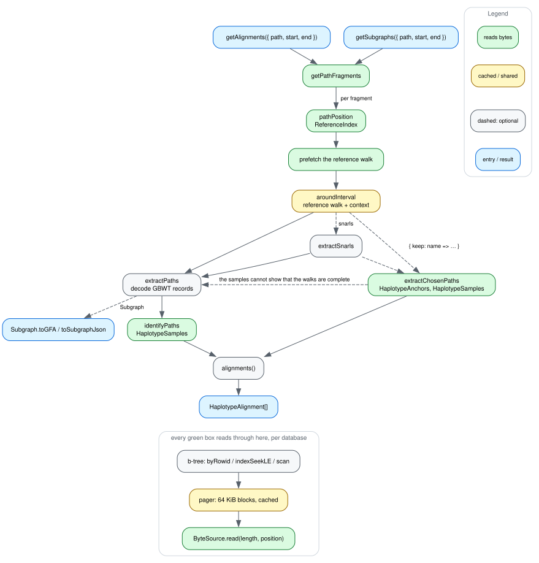

# How a query flows

The source is [dataflow.dot](img/dataflow.dot); see
[CONTRIBUTING.md](../CONTRIBUTING.md#the-data-flow-diagram) to re-render it.

`getAlignmentsForRange` runs every step below. `getSubgraphForRange` stops after
naming and returns the `Subgraph`. A `keep` query on the anchored route replaces
steps 3 to 7 with walks from an anchor.

1. **`pathFragmentsForRange`** finds the path fragments overlapping the window.
   A contig can be stored as several fragments with gaps between them.
2. **`pathPosition`** looks up the GBWT position at the window's start in
   `ReferenceIndex`.
3. **Prefetch** reads the reference walk's node records, one range request per
   run of nearby node ids.
4. **`aroundInterval`** walks the reference across the window and adds `context`
   bp of graph around it. `limit` caps this step.
5. **`extractSnarls`** adds whole snarls when `snarls` is set
   ([snarls.md](snarls.md)).
6. **`extractPaths`** lists every walk crossing the window's nodes.
7. **Naming** gives each walk its haplotype, by the sampled or the anchored
   route ([haplotype-index.md](haplotype-index.md#two-ways-to-name-walks)).
8. **`alignments()`** aligns each walk to the reference and joins pieces of one
   haplotype into a record ([alignments.md](alignments.md)).

Under every step, a pager reads the database in 64 KiB blocks and caches them.
Each block read is one HTTP range request. The graph database and the companion
have separate pagers, and `--stats` counts their requests separately.
